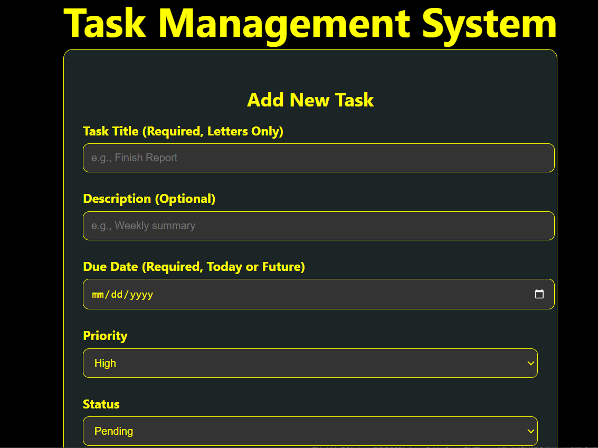
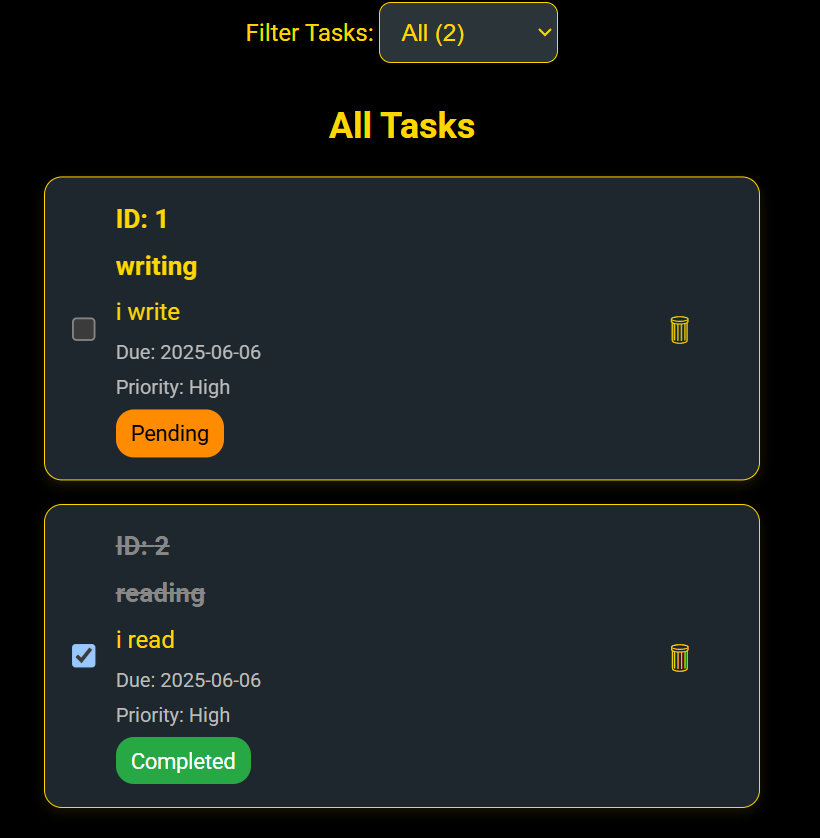

# 🗂️ Task Management System

A simple, clean, and responsive Task Management System built using **React.js**, featuring:

- Add, delete, and check tasks
- Filter tasks by status (All, Completed, Pending)
- Centered dark-themed UI with soft yellow highlights
- Data persistence using **Local Storage**
- Fully responsive design for desktop and mobile

---

## 📸 Preview

---

> 

---

## 🚀 Features

- ✅ Add new tasks with title and status
- ✅ Check/Uncheck tasks to mark as completed
- ✅ Filter tasks by status (All, Completed, Pending)
- ✅ Delete tasks easily
- ✅ Data saved in Local Storage
- ✅ Responsive layout & centered content
- ✅ Stylish UI with soft borders and elegant colors

---

## 🛠️ Technologies Used

- React.js
- JavaScript
- HTML & CSS (custom styled)
- Local Storage API

---

